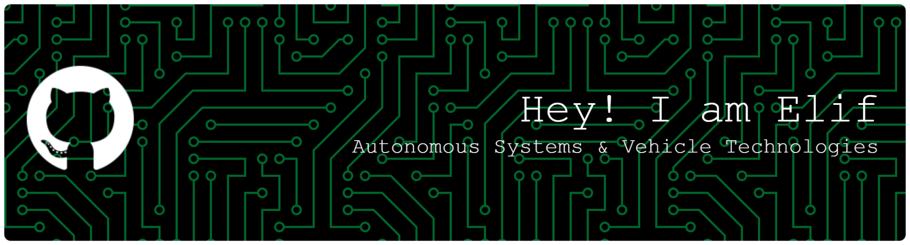
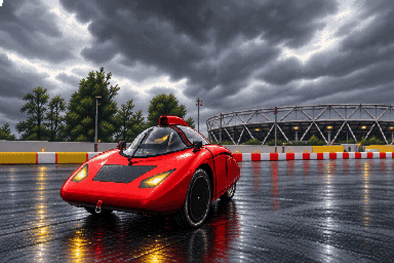

 

# Elif TOK

**Electrical & Electronics Engineering @ Ankara University** &nbsp;·&nbsp; **Electronics & Software**

 

*Electrical and Electronics Engineering student working on autonomous vehicle systems.*  
*Interested in vehicle electronics, embedded software, ROS 2 and computer vision.*

 

&nbsp;

---

## ⬡ &nbsp;What I'm up to

| | |
|---|---|
| 🚗 &nbsp;**Robotaksi** | Developing electronics and software for an autonomous vehicle project |
| ⚡ &nbsp;**Electronics & Software** | Working at the intersection of vehicle electronics, embedded systems and software |
| 📡 &nbsp;**Learning & building** | Improving my skills in ROS 2, computer vision and autonomous-system integration |

---

## ⬡ &nbsp;Tech Stack

**Robotics & Software**

**Electronics & Embedded Systems**

**Tools & Platforms**

---

## ⬡ &nbsp;GitHub Stats

---

## ⬡ &nbsp;Pixel Drive

---

## ⬡ &nbsp;Contribution Activity

<picture>
  <source media="(prefers-color-scheme: dark)" srcset="https://raw.githubusercontent.com/tok-elif/tok-elif/output/github-contribution-grid-snake-dark.svg">
  <source media="(prefers-color-scheme: light)" srcset="https://raw.githubusercontent.com/tok-elif/tok-elif/output/github-contribution-grid-snake.svg">
  
</picture>

---

<code>// updated automatically · tok-elif</code>

